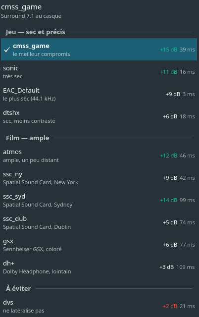
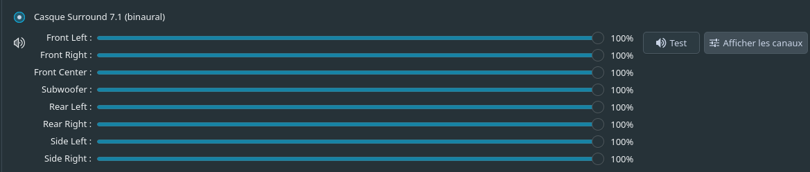

# Spatial Sound KDE

***English** · [Français](README.fr.md)*

A virtual **7.1 binaural** sink for headphones, on PipeWire. A free-software
equivalent of *Spatial Sound Card*, *Dolby Atmos for Headphones* or
*DTS Headphone:X*, none of which are ported to Linux.

The principle is the same as those products: a 7.1 output device appears on the
system, each virtual speaker is convolved with a pair of measured head-related
impulse responses (HRIR), and the result is mixed down to stereo for headphones.

<p align="center">
  
</p>

## What it actually does

The virtual device shows up as a genuine 7.1 card, with its eight channels:



Games and video players see a 7.1 sound card and send it a genuine multichannel
stream. Instead of a plain stereo downmix, every channel is placed in space around
your head. The main gain is not left/right — stereo already does that — but
**front/back and externalisation**: the sound stops forming inside your skull.

## Requirements

`install.sh` checks all of the following and stops with an explicit message if
something is missing. It does not merely print version numbers.

| Required | Check |
|---|---|
| bash ≥ 4.0 | associative arrays |
| PipeWire ≥ 0.3.60 | real version comparison (`sort -V`) |
| `module-filter-chain` | library present |
| `pactl`, `paplay`, `systemctl` | present |
| running PipeWire server | `pactl info` |

| Optional | Without it |
|---|---|
| `ffmpeg` | HRIR format is not validated |
| `python-numpy`, `python-scipy` | no measurement, no test-file generation |
| `pw-link` | final link check skipped |
| Plasma ≥ 6 | applet not installed, everything else works |

The 0.3.60 threshold is not decorative: below it the module loads and the sink
appears, but the graph stays silent — a failure mode that gives you nothing to
diagnose. Same reasoning behind the 14-channel check on HRIR supplied through
`--hrir-dir`.

Tested on Manjaro KDE. **Classic PulseAudio is not supported**: the approach relies
on `module-filter-chain`, which is PipeWire-specific. The script detects it and
exits cleanly.

Dependency installation uses **pacman**. On other distributions the script lists
what is missing and carries on without installing anything.

## Installation

```bash
./install.sh
```

The script checks the environment, fetches the HRIR sets, generates the
configuration, installs `surround-profil` and the applet, starts the dedicated
service and verifies that the sink appears.

| Option | Effect |
|---|---|
| `--profil <name>` | initial profile (default: `cmss_game`) |
| `--hrir-dir <path>` | use local HeSuVi WAVs instead of downloading |
| `--no-default-sink` | do not make the virtual sink the default output |
| `--no-deps` | install nothing through pacman |
| `-y` | ask nothing (and do not reload plasmashell) |

## Choosing a profile

### From the desktop (KDE)

Installation ships a Plasma applet. Right-click the panel or desktop →
*Add Widgets* → **Spatial Sound**. It shows the active profile, the list grouped by
use case, and the measurements next to each name. One click switches.

`install.sh` makes the widget *available*; it does not add it to your panel.
Rearranging an existing desktop layout is the user's decision.

**Installing is not enough to take effect.** `plasmashell` keeps already-loaded QML
and icons in memory, so an applet update stays invisible until it is reloaded.
`install.sh` detects this, reports how long it has been running and offers to
restart it. Under `-y` it does not, and prints the command instead:

```bash
kquitapp6 plasmashell && kstart plasmashell
```

### From the terminal

```bash
surround-profil              # list, with measurements
surround-profil cmss_game    # switch (~0.15 s, without cutting other audio)
surround-profil -a           # all 59 available profiles
surround-profil --data       # TSV output, consumed by the applet
```

Profiles are not equivalent, and **their reputation does not match their contents**.
`tools/analyse_hrir.py` measures them:

| Profile | Reverb | Lateralisation | Use |
|---|---|---|---|
| `cmss_game` | 39 ms | **+15 dB** | best overall compromise, default |
| `sonic` | 16 ms | +11 dB | very dry |
| `EAC_Default` | 3 ms | +9 dB | driest (44.1 kHz) |
| `atmos` | 46 ms | +12 dB | cinema, spacious |
| `ssc_ny` / `ssc_syd` | 42 / 99 ms | +9 / +14 dB | Spatial Sound Card rooms (New York, Sydney) |
| `dh+` | 109 ms | +3 dB | very reverberant despite its FPS reputation |
| `dvs` | 21 ms | **+2 dB** | avoid — does not lateralise |

**Lateralisation** = energy difference between the ear on the source's side and the
other one, on the rear channels. This is the decisive criterion: below ~3 dB the
profile no longer places anything in space, however tonally neutral it may be.

**Reverb** = how long the energy stays above −40 dB. The longer it is, the more
distant the sound feels — pleasant for film, penalising in games.

The script also measures **colouration** (peak-to-peak deviation between 200 Hz and
8 kHz). Do not read it as a quality criterion: `dvs` shows the flattest response of
the whole set (0.7 dB) precisely because it filters almost nothing — and therefore
does not lateralise. An overly flat response is a warning sign, not a guarantee of
neutrality.

## Reverberation control

The **Damping** slider at the foot of the applet shortens the reverberation tail of
the active profile **without changing profile**. This was the missing control: until
now, adjusting perceived distance meant switching profiles, which also changed
lateralisation and tone.

```bash
surround-profil --enveloppe 0     # profile untouched
surround-profil --enveloppe 75    # noticeably drier
surround-profil --enveloppe 100   # driest
```

Measured on `dh+`, the most reverberant of the shipped profiles:

| Damping | Reverb | Lateralisation |
|---|---|---|
| 0 % | 109 ms | +3.4 dB |
| 50 % | 68 ms | +3.9 dB |
| 75 % | 44 ms | +4.2 dB |
| 100 % | 25 ms | +4.5 dB |

**Shortening the tail improves localisation**, never the reverse: reverberation is
decorrelated but carries equal energy to both ears, so it dilutes the interaural
difference. Same mechanism that makes dry profiles lateralise better.

Level stays constant across the whole range, so listening comparisons remain honest.
The original profile is never modified — the result goes to a derived file, and the
setting follows you across profiles.

**It can only shorten.** Lengthening would mean fabricating reverberation that is not
in the material, which is the room generator's job. The slider only appears if
`spatial-sound-gen` could be built.

## Custom rooms

Any **14-channel HeSuVi** WAV dropped into `~/.local/share/pipewire/hrir_hesuvi/`
becomes a profile: it shows up in `surround-profil -a`, in the applet, and can be
measured with `tools/analyse_hrir.py`.

That is the route to room parameters, which this project does not expose itself.
[**ASH Toolset**](https://github.com/ShanonPearce/ASH-Toolset) (AGPL-3.0, tested on
Linux) synthesises room responses from parameters — acoustic space, direct sound gain,
HRTF dataset, room target, bass crossover — and **exports straight to the 14-channel
HeSuVi format**. The resulting file drops in as is.

Measure it before adopting it: `python3 tools/analyse_hrir.py`. Lateralisation remains
the criterion that matters, and a synthesised room is no exception.

## Headphone correction

A layer **distinct** from the profiles above, and complementary to them: an HRIR
profile *places* sounds around your head, a headphone correction *compensates your
model's frequency response*. It moves nothing.

```bash
surround-profil --casque-chercher hyperx      # search among 8850 measured headphones
surround-profil --casque "HyperX Cloud Flight S"
surround-profil --casque-aucune               # back to no correction
```

The filter is fetched on demand from [AutoEQ](https://github.com/jaakkopasanen/AutoEq)
as a minimum-phase FIR at 48 kHz — our rate, so no resampling. At the foot of the applet popup, a field searches the 8850 entries from three
characters on: a checkmark marks filters already present, a « + » those to be
downloaded. Left empty, it lists what is installed. The button on the right removes
the correction.

**A correction is only valid for the model it was measured on.** Applying one meant for
another headphone carves out a peak that is not there and degrades the result. None is
active by default.

Overall level drops by roughly 3–4 dB once a correction is active: that is the headroom
the filter reserves for its boosts, not a loss of quality.

## Testing

```bash
cd ~/.local/share/pipewire/tests-surround
python3 gen_tests.py
paplay -d spatial-sound-sink test_cercle.wav
```

- `test_avant_arriere.wav` — continuous path front → sides → rear → back again
- `test_cercle.wav` — one isolated burst per speaker, clockwise

These are **raw 7.1 tracks**: play them on the virtual sink, not directly. They use
pink-noise bursts, because a steady sine tone barely localises at all.

## Known pitfalls

- **Never enable a game's own "headphones" or "HRTF" mode.** Pick a **7.1** output.
  Otherwise two spatialisations stack and the image turns hollow and strange.
- A stereo game gives no rear placement — only externalisation.
- Only **14-channel** HeSuVi WAVs work; `surround-profil` rejects the rest.
- Voice chat also goes through the convolution and picks up the profile's
  reverberation. To avoid it, send that stream alone to the raw headphone device in
  `pavucontrol`.
- Added latency is on the order of one PipeWire quantum (~21 ms at 1024 @ 48 kHz).
  Lower the quantum if you feel it in games.
- Manjaro ships no `pipewire-filter-chain.service`: `install.sh` writes its own
  `spatial-sound.service` unit.

## Uninstalling

```bash
./uninstall.sh          # remove config and binaries, keep the HRIR
./uninstall.sh --tout   # also erase the HRIR and test files
```

## Installed files

```
~/.config/pipewire/pipewire.conf.d/98-spatial-sound-sink.conf         visible device
~/.config/pipewire/filter-chain.conf.d/99-spatial-sound.conf          convolution graph
~/.config/systemd/user/spatial-sound.service                          dedicated instance
~/.local/share/pipewire/hrir_hesuvi/                                  HRIR profiles
~/.local/share/pipewire/hpcf/                                          headphone corrections + index
~/.local/share/pipewire/tests-surround/                               measurement/test tools
~/.local/bin/surround-profil                                          profile selector
~/.local/bin/spatial-sound-gen                                        room generator
~/.local/share/plasma/plasmoids/org.spatialsound.kde/                 Plasma applet (KDE)
~/.local/share/icons/hicolor/scalable/apps/org.spatialsound.kde.svg   icon
```

## Architecture

The convolution chain does **not** run inside the main PipeWire server, but in a
dedicated instance started by `spatial-sound.service` — which is the intended use of
the `filter-chain.conf` file shipped with PipeWire.

The direct consequence: switching profile only reloads that small instance. Measured
at **0.15 s**, against ~3 s for a full restart of the audio stack, and above all
**without interrupting other streams** — music, chat and browser keep playing. That
is why the configuration lives in `filter-chain.conf.d/` rather than
`pipewire.conf.d/`.

The system-visible device is a **real sink**, declared in the main PipeWire daemon.
The convolution chain runs in the dedicated instance and captures that sink's monitor.

The detour is not gratuitous: a node created by a client — which our sink was until
0.4 — is not registered with the session manager. It worked, but stayed invisible to
`wpctl` and to the panel volume applet, while System Settings displayed it. A daemon
sink is registered.

The front end is static: only the chain behind it reloads when you switch profiles, so
the 0.15 s is preserved.

**Consequence worth knowing**: the chain's output must be explicitly anchored to the
physical device. Without it, WirePlumber routes it to the default sink — which is now
our own — and the chain loops back onto its input, silently. `install.sh` writes the
anchor and verifies there is no loop.

The icon is installed into the `hicolor` theme and referenced by **name**, not by
path: the widget browser only resolves theme icon names.

## Credits

The HRIR sets come from the **HeSuVi** project, which captured the responses of many
commercial virtualisers. The convolution graph derives from the
`sink-virtual-surround-7.1-hesuvi.conf` example shipped with PipeWire.

## Roadmap

Open items are listed in [TODO.md](TODO.md) — headphone compensation
filters (HpCF), AUR packaging, and what has not been verified yet.

## Licence

MIT — see [LICENSE](LICENSE).
